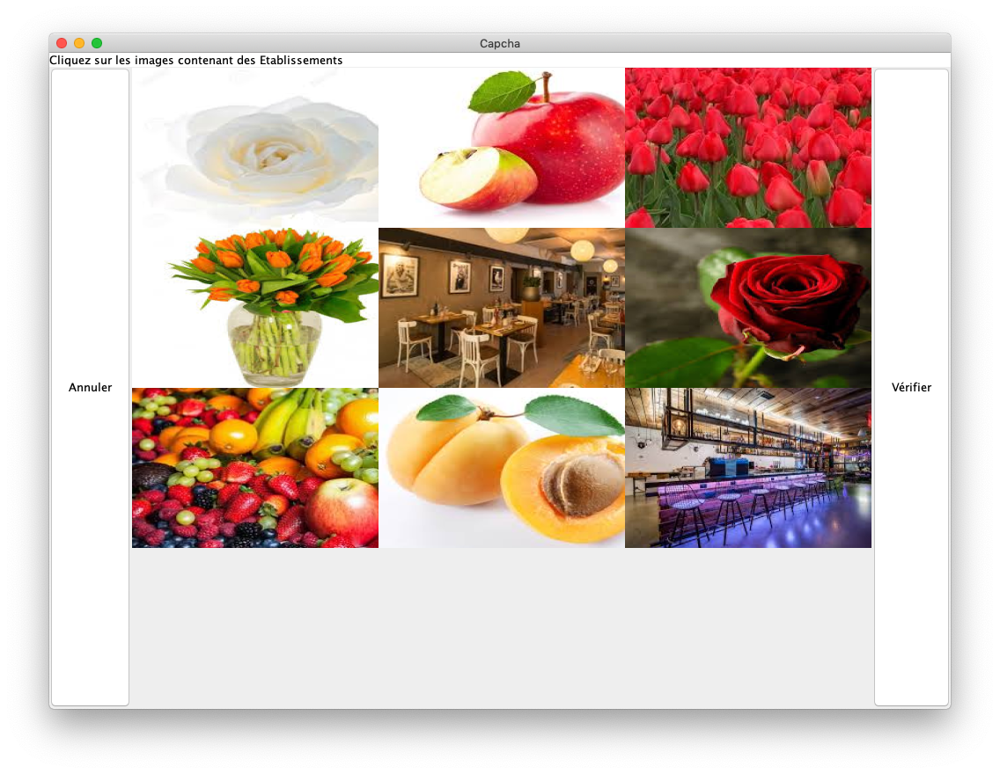
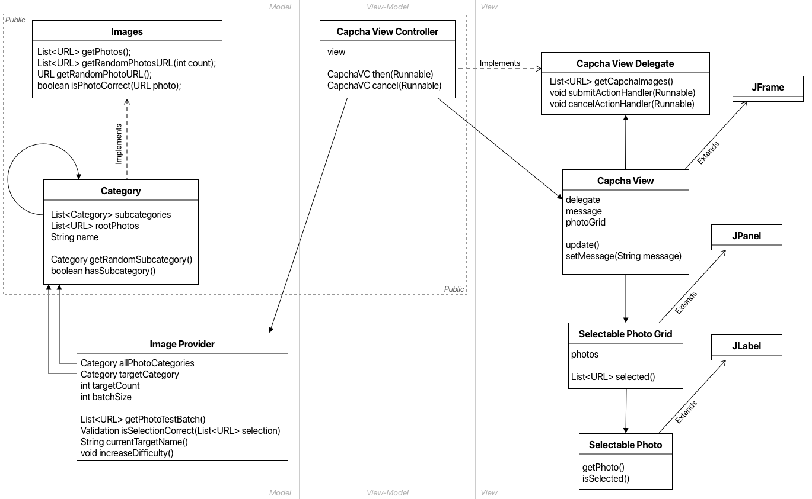

# Capcha IMAC

Solane Genevaux & Pierre Gabory



## Utilisation

### Intégration dans un projet Java

Notre Capcha s’implémente dans votre code de la manière suivante:

``` java
try {
   var capcha = new CapchaViewController(“./chemin/vers/les/photos”);
   capcha.then(() -> { /* l’utilisateur a complété le capcha */ });
   capcha.cancel(() -> { /* l’utilisateur a abandonné le capcha */ };
} catch (IOException exception) {
   /* Le chemin n’est pas accessible */
}
```

L’interface est alors automatiquement lancée à l’instantiation du controller après qu’il ai fini de scanner la bibliothèque qui lui est assignée.

### Appel depuis la console

``` shell
java -jar capcha.jar ./chemin/vers/les/photos
```

Il est aussi possible de faire un appel du capcha en lançant capcha.jar depuis la console.
Ainsi il est facile d’intégrer ce capcha dans des projets C++, Python ou toute autres plateformes.
En fonction des cas (voir code ci-dessus) les messages suivants sont retournés en console:

|              | Message Console                                                                                                                                                | Code |
|--------------|----------------------------------------------------------------------------------------------------------------------------------------------------------------|------|
| then()       | SUCCESS                                                                                                                                                        | 0    |
| cancel()     | CANCEL                                                                                                                                                         | 1    |
| Exception IO | FAILURE  Invalid Photo Directory Path -> ./chemin/vers/les/photos  Make sure to provide a pathname to an existing directory containing supported image files.” | 2    |

## Environnement

``` shell
git clone git@github.com:piergabory/imac2-java-s4-project.git 
git clone https://github.com/piergabory/imac2-java-s4-project.git
```

Pour installer l’environnement de développement, clonez le dépôt Git. Attention, ce dernier contient les +200 jpegs utilisés pour tester. [Pour avoir le projet sans les images téléchargez Release.zip](https://github.com/piergabory/imac2-java-s4-project/blob/master/Release.zip).
Visual Studio Code ou Eclipse est recommandé.

## Choix techniques

### Modèle interface utilisateur

L’architecture de l’interface utilisateur emprunte largement du modèle des applications iOS (delegate, View-Controllers etc…) - car c’est ce que je (*Pierre*) vais faire durant mon stage. Les principes fondamentaux sont: L’isolation vue/modèle et l’abstraction maximale de la relation de la vue vers le contrôleur (par l’utilisation de delegates).

### Schémas UML(-ish)


On notera l’utilisation de l’héritage, des interfaces et de toutes les fonctionnalité objet de java. Le projet fait aussi utilisation généreuse de programmation déclarative, à l’aide des streams. Les applications, réductions et filtres permettent un traitement des images minimaliste et facile à maintenir (voir la classe Category).

### Suite à la soutenance: Introspection, Executables et Parcours Dynamiques

À la fin de la soutenance, nous avons évalué qu’il fallait abandonné notre système de parcours de fichier dynamique en faveur de l’utilisation de l’introspection de classes suggérée dans le sujet.
Cependant, nous avons fini par remarquer que l’introspection causait de nombreux problèmes:

* Elle rends le packaging du projet sous forme d’exécutable JAR impossible (sans modifications de l’interface *Images*, par l’abandon de l’utilisation d’URLs pour l’identification des  images)
* Elle augmente la redondance d’information (le nom des catégories doit être indiqué plusieurs fois dans le système.)
* Elle requiert une manipulation de String pour l’accès aux classes. Ce qui est inélégant.
* Elle requiert l’édition du code pour l’ajout de catégories. Une méthode peu accessible à ceux qui veulent utiliser le logiciel sans connaissance du code.

De ce fait, nous avons conservé notre système de parcours dynamique de la bibliothèque d’image. Car nous pensons qu’il réponds suffisamment au sujet:

* Nous faisons déjà utilisation de l’héritage, surcharge et de l’implémentation d’interface dans notre architecture Model View-Model View (voir schéma UML)
* Nous utilisons déjà la classe Class et les fonctionnalités modernes de Java: (*stream, Files*).
* La classe Category implémente bien l’interface *Images* requise avec le comportement attendu.

### Limitations et Améliorations à faire

* Un groupe d’image présentées à l’utilisateur peut contenir des dupliqués. Nous n’avons pas corrigé ce défaut car cela permet d’éviter des problèmes dans les catégories ou il y a très peu d’images.
* Le chargement du capcha est trop long. Il y a potentiellement des problèmes d’optimisation dans le parcours récursif de la bibliothèque d’image ou bien du chargement des images. Au minimum, un écran de chargement devrait être présenté.
* Le layout de l’interface est à revoir.
